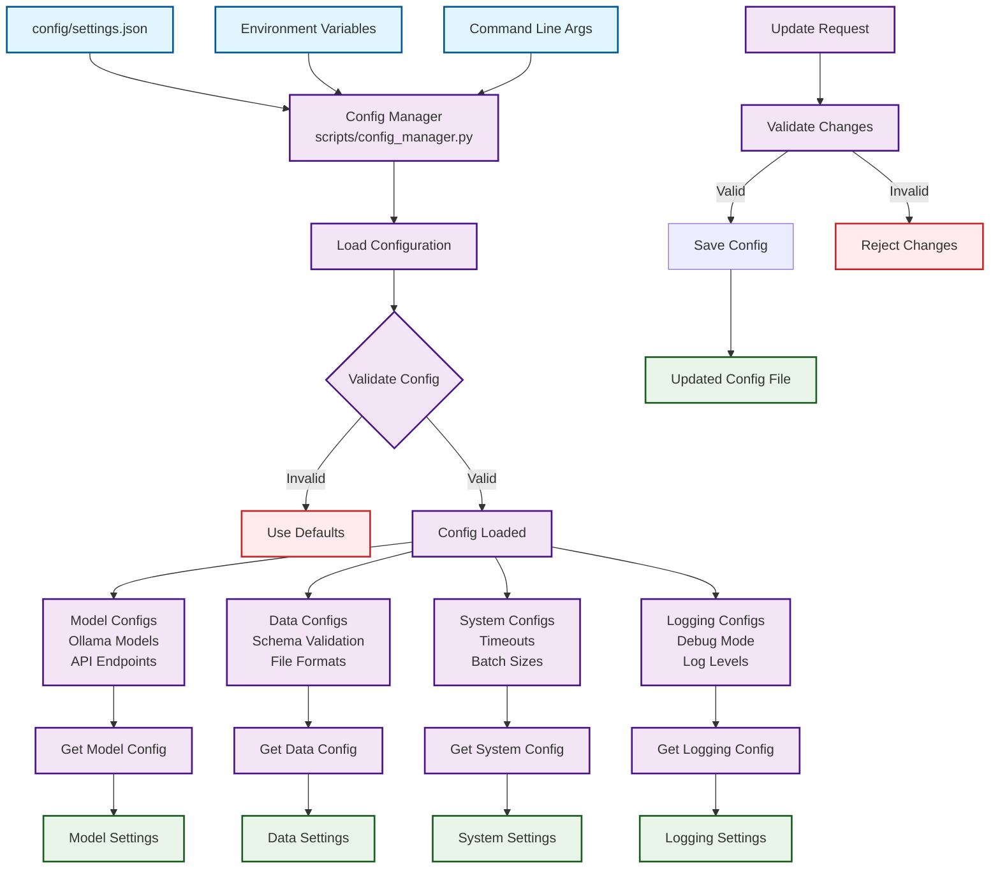

# Config Manager Flowchart

## Configuration Management System



## Configuration Management Process

### **1. Configuration Sources**
- **Settings File**: `config/settings.json` - Primary configuration
- **Environment Variables**: Override settings for deployment
- **Command Line**: Runtime configuration adjustments

### **2. Configuration Validation**
- **Schema Validation**: Ensures required fields are present
- **Type Checking**: Validates data types and formats
- **Default Fallback**: Uses sensible defaults for missing values

### **3. Configuration Types**
- **Model Configs**: Ollama model settings, API endpoints
- **Data Configs**: Schema validation rules, file format settings
- **System Configs**: Timeouts, batch sizes, performance settings
- **Logging Configs**: Debug mode, log levels, output formats

### **4. Configuration Access**
- **Get Methods**: Retrieve specific configuration sections
- **Update Methods**: Modify configurations with validation
- **Save Methods**: Persist changes to configuration files

## Configuration Structure

```json
{
  "models": {
    "ollama": {
      "base_url": "http://localhost:11434",
      "timeout": 180,
      "models": ["llama3.2:1b", "mistral:latest"]
    }
  },
  "data": {
    "schema_validation": true,
    "required_columns": ["Expert Rating", "Rationale of Rating"],
    "file_formats": ["csv", "xlsx"]
  },
  "system": {
    "batch_size": 1,
    "max_retries": 2,
    "debug_mode": true
  },
  "logging": {
    "level": "INFO",
    "file_output": true,
    "console_output": true
  }
}
```

## Key Features

### **Flexible Configuration**
- Multiple configuration sources
- Environment variable overrides
- Runtime configuration updates
- Validation and error handling

### **Type Safety**
- Schema validation
- Type checking
- Default value fallbacks
- Error reporting

### **Easy Access**
- Simple getter methods
- Configuration sections
- Nested configuration support
- Automatic reloading

---

*The Config Manager provides centralized configuration management for the entire EpiTuner system.* 