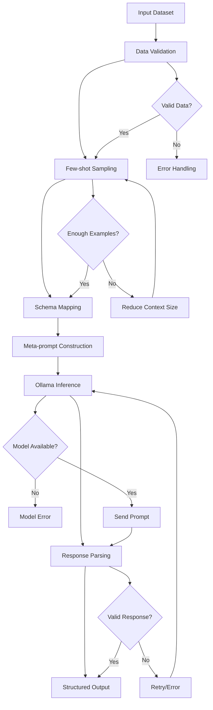
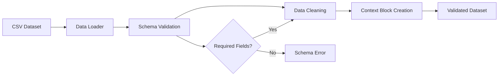
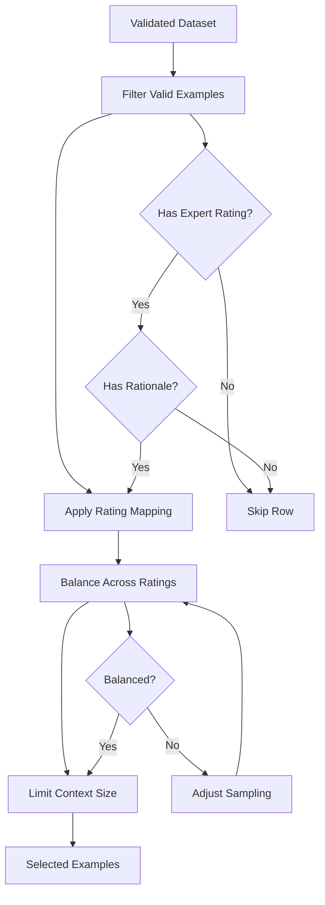
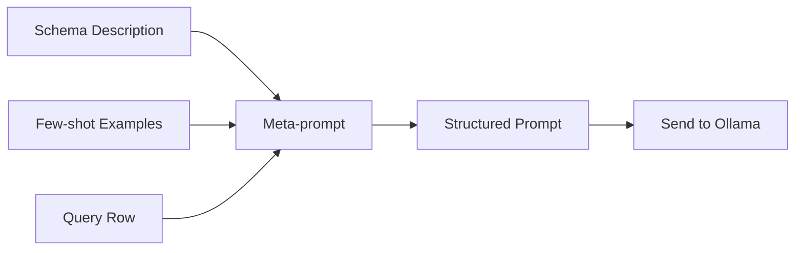
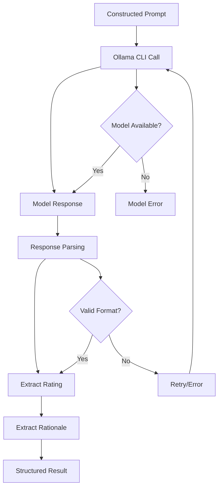
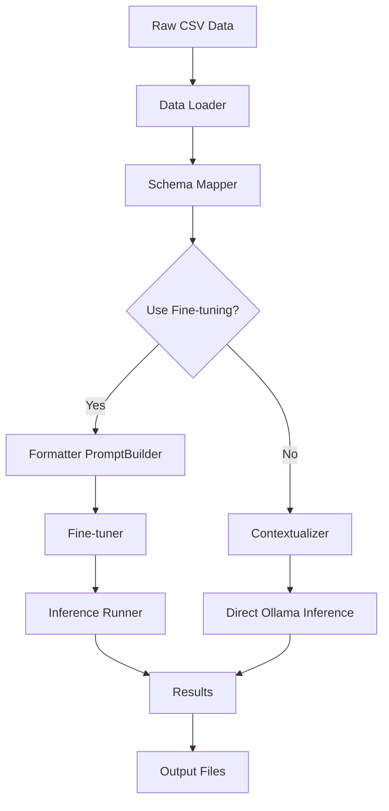
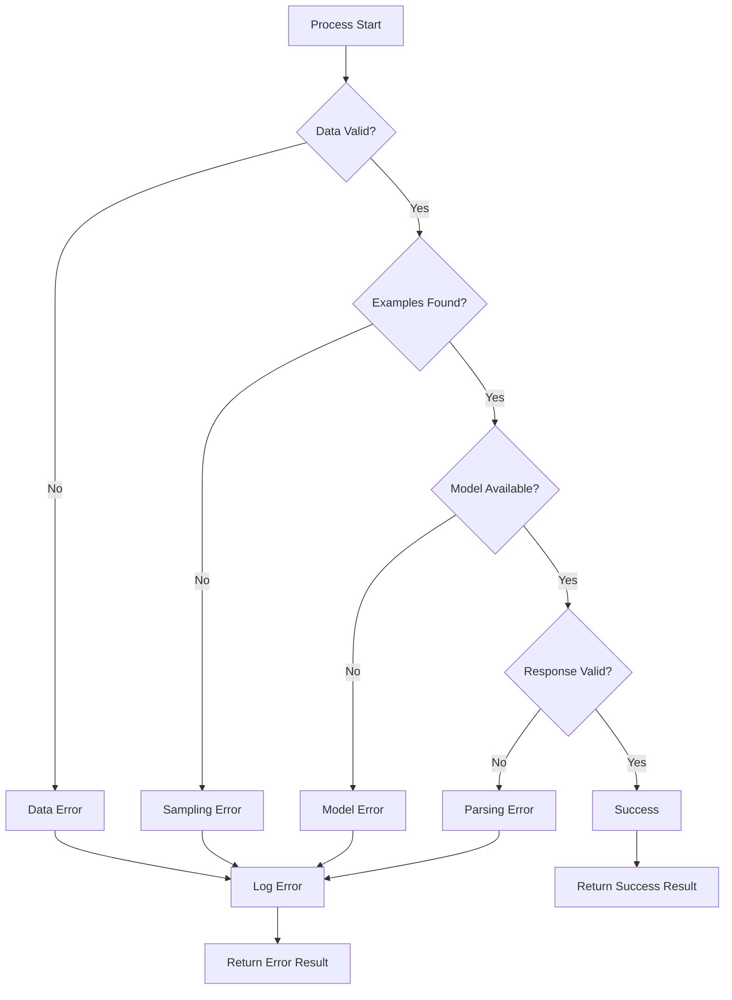
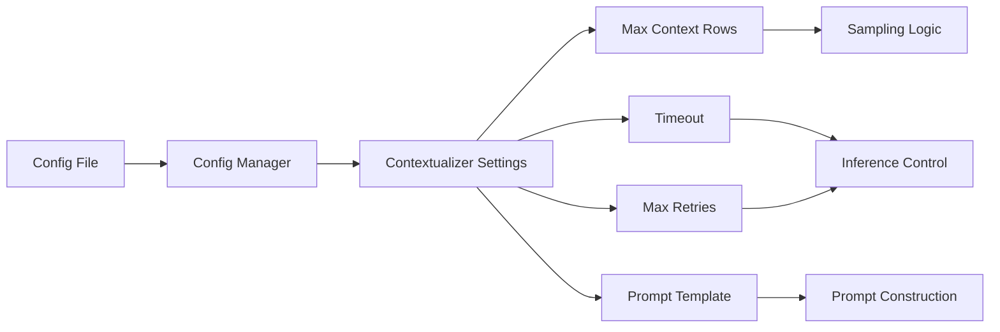
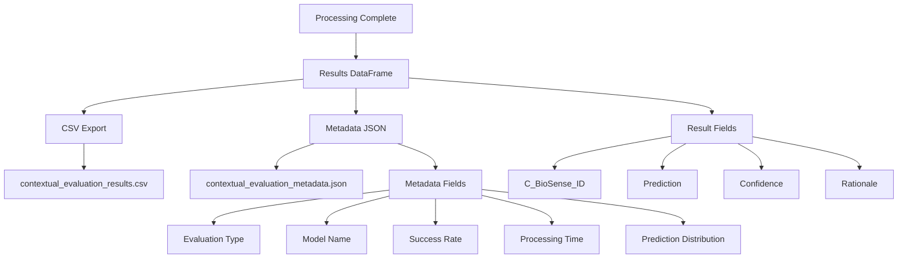
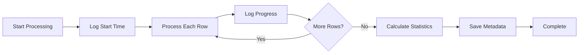

# Contextualizer Flow Diagram

## Overview

The Contextualizer provides a fallback approach for scenarios where fine-tuning is not available or cost-effective. It uses few-shot learning with structured meta-prompts to guide base Ollama models.

## Main Flow

## Detailed Process Flow

### 1. Data Input and Validation

### 2. Few-shot Example Sampling

### 3. Meta-prompt Construction

### 4. Inference and Response Processing

## Integration with Existing Pipeline

## Error Handling Flow

## Configuration Flow

## Output Structure

## Performance Monitoring

## Key Decision Points

1. **Data Validation**: Ensures required fields and data quality
2. **Example Sampling**: Balances representation across rating categories
3. **Model Availability**: Checks if specified Ollama model is available
4. **Response Validation**: Ensures model output can be parsed
5. **Error Recovery**: Implements retry logic and graceful degradation

## Success Metrics

- **Success Rate**: Percentage of successfully processed rows
- **Processing Time**: Total time for dataset evaluation
- **Prediction Distribution**: Spread of predictions across rating categories
- **Error Types**: Classification of different error conditions
- **Model Performance**: Response quality and consistency 