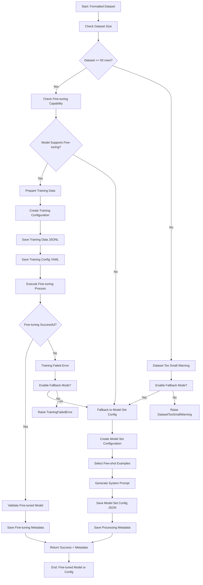
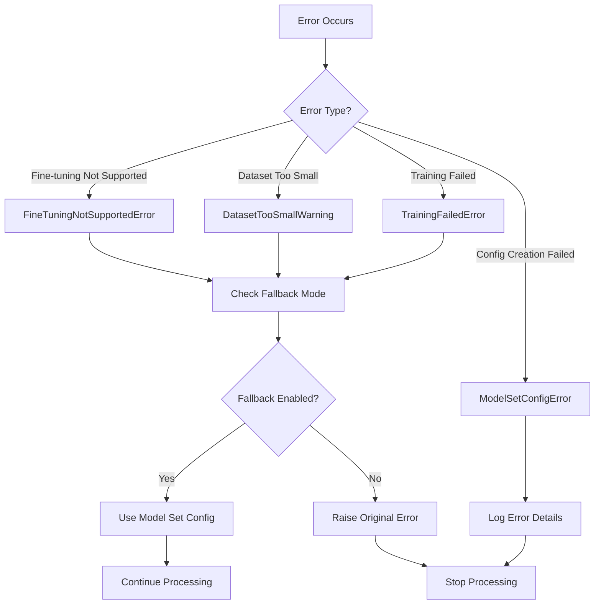

# Fine Tuner Flow Diagram

## Process Flow

## Decision Points

### 1. Dataset Size Check
- **Condition**: Dataset has >= 50 rows
- **Yes**: Proceed to fine-tuning capability check
- **No**: Warn about small dataset size

### 2. Fine-tuning Capability Check
- **Condition**: Base model supports fine-tuning
- **Yes**: Proceed with fine-tuning approach
- **No**: Fall back to model set configuration

### 3. Fine-tuning Success Check
- **Condition**: Fine-tuning process completes successfully
- **Yes**: Validate and save fine-tuned model
- **No**: Check fallback mode setting

### 4. Fallback Mode Check
- **Condition**: Fallback mode is enabled
- **Yes**: Use model set configuration approach
- **No**: Raise appropriate error

## Data Flow

### Input Data
- Formatted dataset (CSV)
- Model name
- Rating mapping
- Target topics
- Fine-tuning parameters

### Intermediate Data
- Training data (JSONL format)
- Training configuration (YAML)
- Model set configuration (JSON)

### Output Data
- Fine-tuned model (.gguf) OR
- Model set configuration (JSON)
- Processing metadata (JSON)

## Error Handling Flow

## Integration Points

### Upstream Dependencies
- **formatter_promptbuilder**: Provides formatted dataset
- **schema_mapper**: Provides rating mapping

### Downstream Dependencies
- **inference_runner**: Uses fine-tuned model or model set config
- **contextualizer**: May use model set config for meta-prompting

## Performance Considerations

### Fine-tuning Approach
- **Memory**: High memory usage during training
- **Time**: Training time scales with dataset size and epochs
- **Storage**: Requires space for training data and model files

### Model Set Configuration Approach
- **Memory**: Low memory usage
- **Time**: Fast configuration generation
- **Storage**: Minimal storage requirements

## Monitoring Points

### Key Metrics
- Dataset size validation
- Fine-tuning capability check
- Training progress monitoring
- Model validation results
- Configuration generation success

### Logging Levels
- **DEBUG**: Detailed training progress
- **INFO**: Process milestones
- **WARNING**: Dataset size issues, fallback usage
- **ERROR**: Training failures, configuration errors 