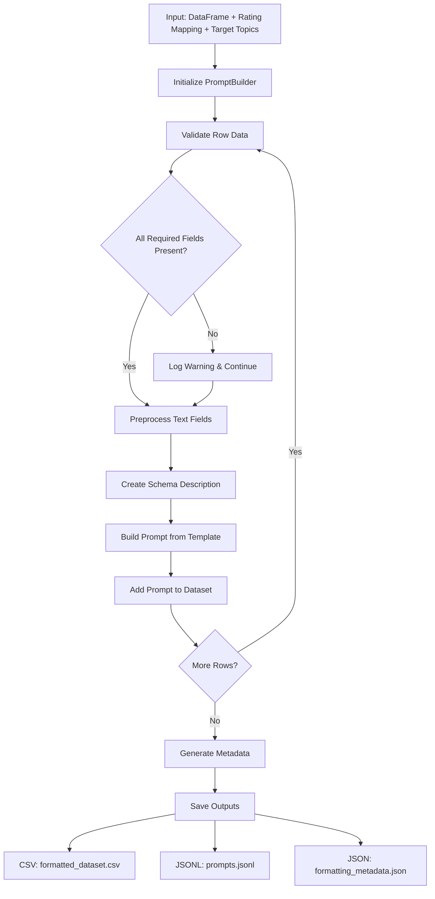
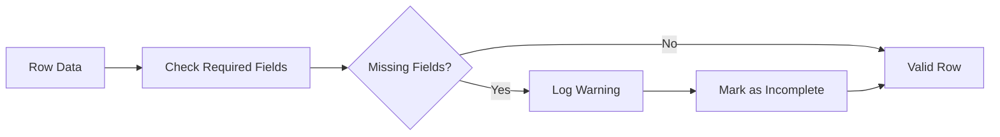
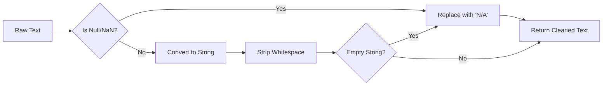
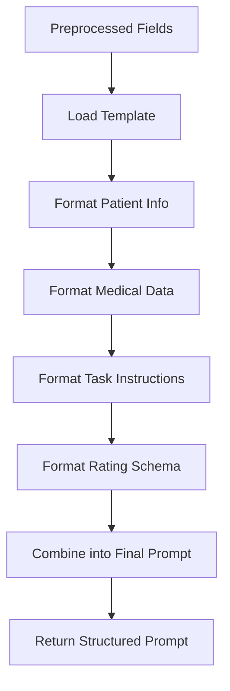
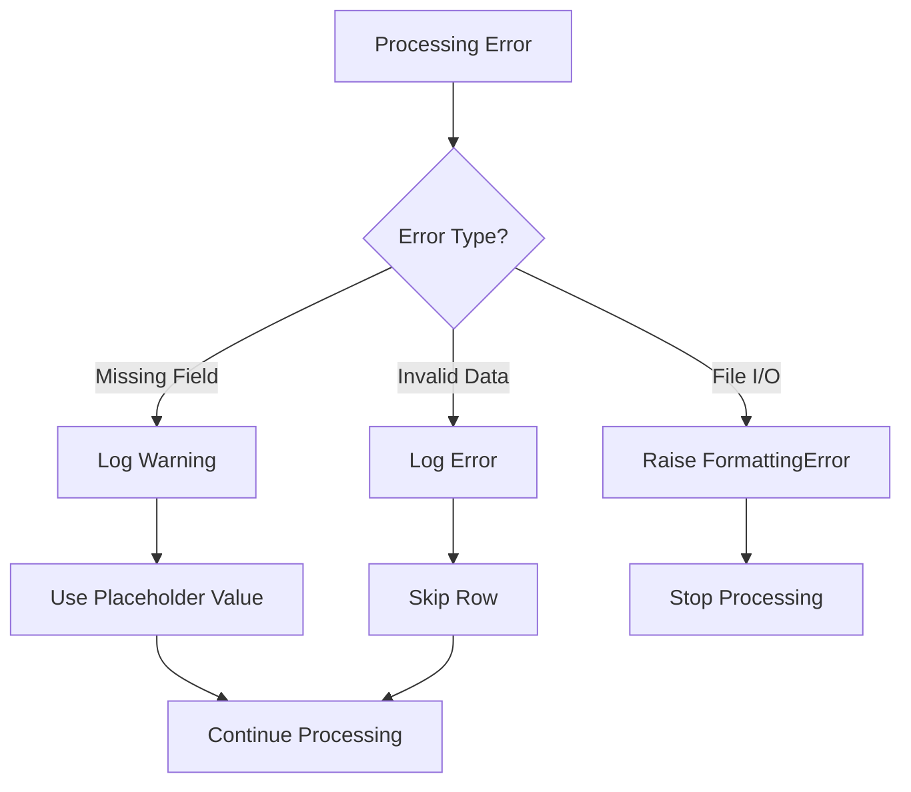
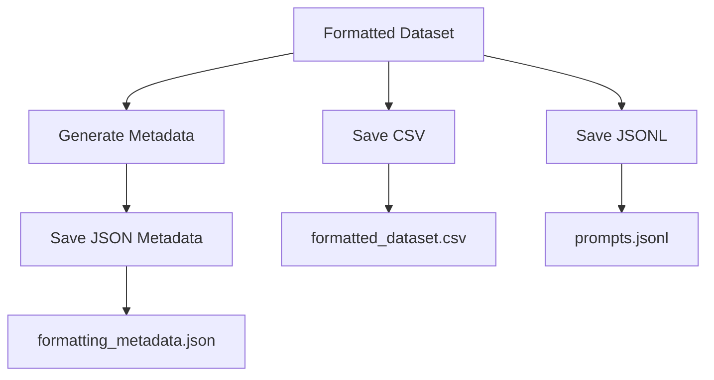

# Formatter PromptBuilder Flow Diagram

## Overview
This document illustrates the data flow and processing steps in the Formatter PromptBuilder module.

## Main Processing Flow



## Detailed Processing Steps

### 1. Data Validation


### 2. Text Preprocessing


### 3. Prompt Construction


## Error Handling Flow



## Output Generation Flow



## Integration Points

### Input Integration
- **data_loader**: Provides cleaned DataFrame with required fields
- **schema_mapper**: Provides rating mapping dictionary

### Output Integration
- **inference_runner**: Uses prompts.jsonl for LLM calls
- **fine_tuner**: Uses prompts.jsonl for model training
- **contextualizer**: Uses prompts for few-shot examples

## Data Transformation Examples

### Input Row
```json
{
  "C_BioSense_ID": "P001",
  "ChiefComplaintOrig": "Fever",
  "Discharge Diagnosis": "Viral infection",
  "Sex": "M",
  "Age": 25,
  "Admit_Reason_Combo": "Fever",
  "Chief_Complaint_Combo": "Fever",
  "Diagnosis_Combo": "Infection",
  "CCDD": "Fever",
  "CCDDCategory": "Viral",
  "TriageNotes": "High fever with chills"
}
```

### Output Prompt
```
Context:
- Patient Info: Age 25, Sex M
- Chief Complaint: Fever
- Discharge Diagnosis: Viral infection
- Admit Reason: Fever
- Combined Complaints: Fever
- Diagnosis Combo: Infection
- CCDD: Fever, Category: Viral
- Triage Notes: High fever with chills

Task:
Based on the above information, evaluate whether this record aligns with the topic(s): respiratory infections.
Use the following rating schema:
- Match (1)
- Does Not Match (0)
- Unknown (-1)

Respond with:
- Numeric rating (from schema).
- Brief rationale (1–3 sentences).
```

## Performance Considerations

### Memory Usage
- Processes rows sequentially to minimize memory footprint
- No large intermediate data structures

### Processing Speed
- Text preprocessing is O(n) where n is number of fields
- Template formatting is O(1) per row
- Overall complexity: O(rows × fields)

### Scalability
- Handles datasets from 5 to 500+ rows efficiently
- Output file sizes scale linearly with input size 